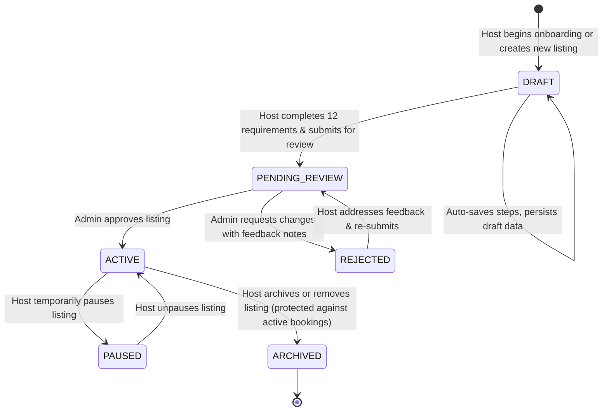
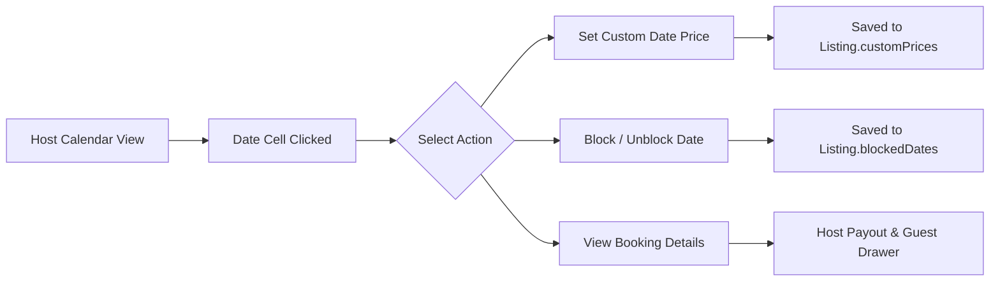
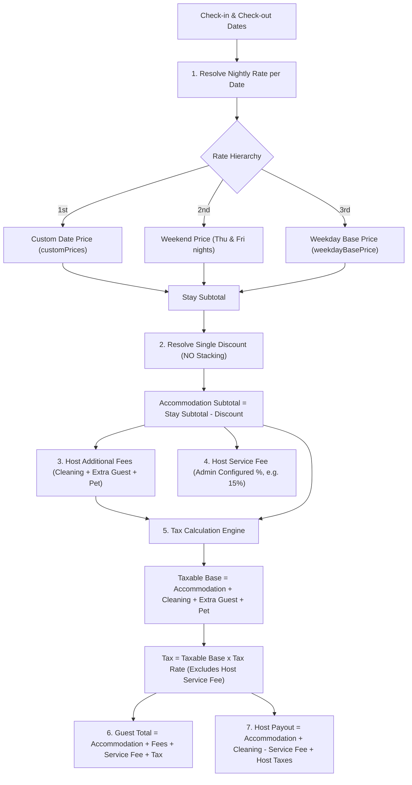

# Complete Homyz Host Property Listing Architecture & Process Documentation

This document provides a comprehensive, end-to-end technical and functional reference of the **Host Property Listing Process** currently implemented, operational, and verified across the Homyz platform.

---

## Table of Contents
1. [System Architecture & Lifecycle Overview](#1-system-architecture--lifecycle-overview)
2. [Flow 1: Creation Wizard ("Become a Host" / Add Listing)](#2-flow-1-creation-wizard-become-a-host--add-listing)
3. [Flow 2: Host Listing Editor ("Your Space")](#3-flow-2-host-listing-editor-your-space)
4. [Flow 3: Arrival Guide](#4-flow-3-arrival-guide)
5. [Flow 4: Listing Preferences & Settings](#5-flow-4-listing-preferences--settings)
6. [Flow 5: Host Calendar & Workspace](#6-flow-5-host-calendar--workspace)
7. [Flow 6: Authoritative Pricing & Tax Engine](#7-flow-6-authoritative-pricing--tax-engine)
8. [Data Models & Schema Specifications](#8-data-models--schema-specifications)
9. [Security, Privacy Masking & Permissions](#9-security-privacy-masking--permissions)

---

## 1. System Architecture & Lifecycle Overview

### Complete Listing Lifecycle
The platform enforces a strict multi-state finite state machine (FSM) governing listing visibility, moderation, and booking readiness:



### Published State Matrix
- **`published: false`**: Private to host & admin; excluded from search, category carousel, and public quote routes.
- **`published: true` + `status: ACTIVE`**: Live on marketplace, bookable by verified guests.

---

## 2. Flow 1: Creation Wizard ("Become a Host" / Add Listing)

- **Entry Point**: Navigation header `"Become a Host"` or `/host/listings/new`
- **Controller**: [`components/host/new-listing-get-started.tsx`](components/host/new-listing-get-started.tsx)
- **Architecture**: 3 Parts, 19 Sequential Steps (indices `0` to `18`), automatic draft persistence, resume capability via URL query params (`?step=X&draftId=Y`).

### Part 1: The Basics (Steps 0 – 6)

| Step # | Slug | Component | Title / Purpose | Controls & Behaviors |
| :--- | :--- | :--- | :--- | :--- |
| **Step 0** | `overview` | `StepOverview.tsx` | Welcome & Journey Map | Interactive 3-part roadmap overview with "Get Started" CTA. |
| **Step 1** | `intro` | `StepIntro.tsx` | Step 1 Introduction | Explains basics needed: place type, address, guest capacity. |
| **Step 2** | `category` | `StepCategory.tsx` | Property Category | Grid selector of 14 property types: House, Apartment, Barn, Bed & Breakfast, Boat, Cabin, Camper/RV, Castle, Container, Guest House, Hotel, Houseboat, Riads, Ryokans. |
| **Step 3** | `place-type` | `StepPlaceType.tsx` | Listing Privacy Type | Radio selection cards: **An entire place** (guests have whole place to themselves), **A private room** (own bedroom with shared areas), **A shared room** (sleep in room with others). |
| **Step 4** | `location` | `StepLocationSearch.tsx` | Map & Search | Interactive search input with debounced OpenStreetMap / Nominatim geocoding, autocomplete dropdown, coordinate resolution, and interactive draggable Leaflet pin. |
| **Step 5** | `address` | `StepAddressConfirm.tsx` | Address Details | Form inputs: Street address, Apt/Suite/Unit (optional), City, State/Province, Postal/Zip code, Country dropdown. Includes **"Show exact location"** toggle (approximate location vs pinpoint). |
| **Step 6** | `basics` | `StepBasicsCounters.tsx` | Capacity Counters | Increment/decrement counter controls: Guests capacity (min 1), Bedrooms count (0 for Studio up to 50), Beds count (min 1), Bathrooms count (increments of 0.5). |

### Part 2: Make It Stand Out (Steps 7 – 13)

| Step # | Slug | Component | Title / Purpose | Controls & Behaviors |
| :--- | :--- | :--- | :--- | :--- |
| **Step 7** | `standout` | `StepStandoutIntro.tsx` | Step 2 Introduction | Outlines photo, title, highlight tags, and description requirements. |
| **Step 8** | `amenities` | `StepAmenities.tsx` | Amenity Selection | Multi-select grouped into Essentials (Wi-Fi, TV, Kitchen, Washer), Features (Pool, Hot tub, Free parking, EV charger, BBQ), and Safety (Smoke alarm, First aid kit, Fire extinguisher). |
| **Step 9** | `photos` | `StepPhotos.tsx` | Photo Upload | Drag-and-drop & file picker uploading to `/api/v1/upload/listing-photo`. Enforces **minimum 5 photos**, image MIME type security (PNG, JPG, WEBP), zero temporary `blob:` URLs. |
| **Step 10** | `photos-review`| `StepPhotoManagement.tsx` | Photo Reordering & Cover | Gallery grid: designate Cover Photo (index 0 badge), reorder photos, delete photo modal, upload additional high-resolution images. |
| **Step 11** | `title` | `StepTitle.tsx` | Listing Title | Single-line input with real-time character counter (3 to 50 characters). Rejects profanity, excessive capitalization, or empty titles. |
| **Step 12** | `highlights` | `StepHighlights.tsx` | Property Highlights | Tag selector (pick up to 3): Peaceful, Unique, Family-friendly, Stylish, Central, Spacious, Romantic, Scenic. |
| **Step 13** | `description`| `StepDescription.tsx` | Detailed Description | Multi-line textarea for space narrative with 10-character minimum validation. |

### Part 3: Finish Up and Publish (Steps 14 – 18)

| Step # | Slug | Component | Title / Purpose | Controls & Behaviors |
| :--- | :--- | :--- | :--- | :--- |
| **Step 14** | `finish-intro` | `StepFinishIntro.tsx` | Step 3 Introduction | Explains pricing setup, discounts, and safety disclosures. |
| **Step 15** | `price` | `StepPrice.tsx` | Weekday Base Price | Numeric price input in SAR/cents. Real-time preview calculates host net payout after platform Host Service Fee deduction. |
| **Step 16** | `weekend-price`| `StepWeekendPrice.tsx` | Weekend Nightly Rate | Weekend pricing for **Thursday and Friday nights** in Saudi Arabia / Middle East. Supports custom premium or fixed weekend rate. |
| **Step 17** | `discounts` | `StepDiscounts.tsx` | Length-of-Stay Discounts | Toggles and percentage inputs: New listing promotion (20% for first 3 bookings), Weekly discount (7+ nights, default 10%), Monthly discount (28+ nights, default 25%). |
| **Step 18** | `safety` | `StepSafety.tsx` | Safety Disclosures | Mandatory disclosure checkboxes: Exterior security cameras/audio recording devices, Noise decibel monitors, Weapons on property. Local regulatory compliance acknowledgment. |

### Wizard Review & Publish Verification Modal
- **Completion Check (`COMPLETION_REQUIREMENTS`)**:
  - Property type, Listing type, Confirmed coordinates, Address, Valid guest & bed capacity, Minimum 5 photos, Title (3–50 chars), Highlights (max 3), Description (min 10 chars), Weekday base price (> 0), Weekend price, Safety disclosures answered.
- **Save & Exit**: At any step, the host can click "Save & exit" to persist the draft to database and resume later.
- **Publish Submission**:
  - `status`: Transitions to `PENDING_REVIEW` (or `ACTIVE` if instant publishing is authorized).
  - Triggers admin notification and updates host dashboard.

---

## 3. Flow 2: Host Listing Editor ("Your Space")

- **Route**: `/host/listings/[id]`
- **Client Root**: [`app/(protected)/host/listings/[id]/host-listing-editor-client.tsx`](app/(protected)/host/listings/[id]/host-listing-editor-client.tsx)
- **Sidebar & Layout**: [`components/EditorSidebar.tsx`](app/(protected)/host/listings/[id]/components/EditorSidebar.tsx) (Three top-level sub-pills: `[Your space]`, `[Arrival guide]`, `[⚙️ Preferences]`)
- **Right Panel**: Real-time live listing preview card updating instantly on state changes.

### "Your Space" Sections & Functionality

#### 1. Photos (`photos`)
- Gallery management modal with cover photo designation.
- Real-time image uploading to `/api/v1/upload/listing-photo`.
- Reorder, caption, and delete controls with minimum 5 photo safeguard.

#### 2. Title & Descriptions (`title`, `description`)
- **Title**: Quick inline edit with 50-character limit.
- **Structured Description Subsections**:
  - `property`: Description of space, ambiance, and style.
  - `guestAccess`: Specific areas guests are permitted to access (e.g. garden, pool, private balcony).
  - `guestInteraction`: Host interaction style and communication preferences.
  - `otherDetails`: Special notices, quiet hours, check-in logistics.

#### 3. Property & Listing Type (`propertyType`)
- Change property category (Apartment, House, Villa, Studio, etc.).
- Switch listing privacy type (Entire place, Private room, Shared room).

#### 4. Rooms & Sleeping Arrangements (`sleeping-arrangements`)
- Structured room breakdown ([`lib/validation/listing.ts`](lib/validation/listing.ts)):
  - Room type selection (`BEDROOM`, `LIVING_ROOM`, `COMMON_SPACE`).
  - Bed types with independent quantity counters:
    - King Bed, Queen Bed, Double Bed, Single/Twin Bed, Sofa Bed, Bunk Bed, Crib, Air Mattress.
- Automatic aggregation of total beds and bedroom counts.

#### 5. Bathrooms & Capacity (`guests`)
- Guest capacity limit counter (1 to 50).
- Full bathrooms counter (toilet + shower/bath).
- Half bathrooms counter (toilet + sink only).

#### 6. Canonical Amenities Catalog (`amenities`)
- Central catalog ([`lib/constants/amenities.ts`](lib/constants/amenities.ts)) containing **93 canonical amenities** organized across **17 categories**:
  1. Essentials (Wi-Fi, TV, AC, Heating, Dedicated workspace, Linens, Hangers)
  2. Kitchen & Dining (Refrigerator, Microwave, Cooking basics, Stove, Oven, Dishwasher, Coffee maker)
  3. Bathroom (Hair dryer, Shampoo, Hot water, Shower gel)
  4. Bedroom & Laundry (Washer, Dryer, Iron, Extra pillows/blankets)
  5. Entertainment (Pool table, Game console, Sound system)
  6. Family (Crib, High chair, Baby bath, Children's dinnerware)
  7. Heating & Cooling (AC, Central heating, Indoor fireplace, Ceiling fan)
  8. Home Safety (Smoke alarm, CO alarm, Fire extinguisher, First aid kit)
  9. Internet & Office (High-speed Wi-Fi, Ethernet, Desk)
  10. Outdoor (Patio/balcony, Backyard, Outdoor furniture, BBQ grill)
  11. Parking & Facilities (Free parking on premises, Paid parking off premises, EV charger, Pool, Hot tub, Gym)
  12. Services (Luggage dropoff allowed, Long term stays allowed, Self check-in)
  13. Scenic Views (City skyline, Garden, Mountain, Sea/ocean, Pool view)
  14. Location Features (Beach access, Ski-in/ski-out, Waterfront)
  15. Accessibility (Step-free entrance, Lit path, Wide doorways)
  16. Unique Features (Fire pit, Hammock)
  17. Not Included / Disclosures

#### 7. Accessibility Features (`accessibility`)
- Detailed feature toggles:
  - Accessible parking spot, Step-free path to entrance, Lit path to guest entrance, Guest entrance wider than 32 inches, Step-free bathroom, Roll-in shower with bench, Fixed grab bars, Ceiling/mobile hoist, Pool hoist.
- High-resolution photo upload support for each accessibility claim.

#### 8. Location & Extended Neighborhood (`location`)
- Street address, Unit/Apt, City, State, Postal Code, Country.
- Interactive Leaflet map with draggable pin coordinate update.
- **Privacy Setting**: `showExactLocation` toggle:
  - When `true`: Public map shows exact pin; confirmed street address visible.
  - When `false`: Public map shows approximate circle (~1.1 km radius, coordinates rounded to 2 decimals); street address masked until booking is confirmed.
- **Neighborhood Narrative**:
  - Neighborhood overview text.
  - Getting around (metro stations, bus stops, taxi availability).
  - Scenic views selection (City, Ocean, Courtyard, Desert, Garden).

#### 9. About the Host (`about-host`)
- Host profile photo, Display name, Verified host badges.
- "About me" narrative bio.
- **"Where I've Been"**: Travel passport stamp selector with visual country stamps ([`components/profile/where-ive-been-selector.tsx`](components/profile/where-ive-been-selector.tsx)).
- Languages spoken multi-select with localized display names.

#### 10. Co-Hosts Management (`co-host`)
- Service: [`services/listing-cohost.service.ts`](services/listing-cohost.service.ts)
- Invite co-hosts via email or phone.
- Granular permissions: Full access, Calendar & messaging only, Read-only view.
- Acceptance flow, status indicators (`PENDING`, `ACCEPTED`, `REVOKED`).

#### 11. Booking Settings & Mode (`booking-settings`)
- **Instant Book Toggle**:
  - Enabled: Guests who meet all requirements book immediately without host pre-approval.
  - Disabled (Request to Book): Host manually reviews and approves each booking inquiry within 24 hours.
- **Guest Requirements**:
  - Verified phone & email requirement.
  - Good track record requirement (recommendation from other hosts, zero negative reviews).
- **Pre-Booking Custom Message**: Custom prompt shown to guests before booking (e.g. "Please share the purpose of your trip and arrival time").

#### 12. House Rules (`house-rules`)
- Standard rule toggles:
  - Children allowed (2–12 years)
  - Infants allowed (under 2 years)
  - Pets allowed (with optional pet fee)
  - Smoking allowed
  - Events / parties allowed
  - Commercial photography & filming allowed
- Quiet hours time picker (e.g., 10:00 PM – 8:00 AM).
- Maximum guest limit enforcement.
- Custom house rules list (add/remove custom rules).

#### 13. Guest Safety Disclosures (`guests-safety`)
- Safety disclosures ([`app/(protected)/host/listings/[id]/components/GuestsSafetyView.tsx`](app/(protected)/host/listings/[id]/components/GuestsSafetyView.tsx)):
  - Exterior security cameras or audio recording devices (location disclosure required).
  - Carbon monoxide alarm presence.
  - Smoke alarm presence.
  - First aid kit presence.
  - Fire extinguisher presence.
  - Property hazards (steep drops, pool without gate, climbing structures).

#### 14. Cancellation Policy (`cancellation-policy`)
- Flexible, Moderate, Firm, Strict policy selectors with exact refund timelines.

#### 15. Custom Listing Link / Slug (`custom-link`)
- Custom vanity URL builder: `homyz.co/rooms/[your-custom-slug]`
- Automated slugification, collision detection, and uniqueness validation.

---

## 4. Flow 3: Arrival Guide

- **Sidebar Pill**: `[Arrival guide]`
- **Component**: [`app/(protected)/host/listings/[id]/components/HouseRulesAndArrivalViews.tsx`](app/(protected)/host/listings/[id]/components/HouseRulesAndArrivalViews.tsx)
- **Privacy Enforcement**: All access codes, Wi-Fi passwords, and exact check-in manuals are **strictly masked** in public DTOs and revealed only to confirmed guests during active reservation windows.

| Section | Slug | Features & Implemented Controls |
| :--- | :--- | :--- |
| **Check-in & Checkout Times** | `check-in-out` | Dropdowns for Check-in start time (e.g. 3:00 PM), Check-in cutoff time (e.g. 10:00 PM), and Checkout deadline (e.g. 11:00 AM). |
| **Check-in Access Method** | `check-in-method` | Select access method: **Smart lock**, **Keypad**, **Lockbox**, **In-person host greeting**, **Building staff / concierge**. Masked door code and lockbox code inputs. Detailed step-by-step check-in instructions textarea. |
| **Wi-Fi Details** | `wifi-details` | Network name (SSID) input and Wi-Fi password input. Masked on client side with reveal toggle for host. |
| **House Manual** | `house-manual` | Rich text guide for operating appliances: AC/thermostat, TV/entertainment, washing machine, garbage disposal, trash chute location. |
| **Parking Instructions** | `parking` | Parking type selector (Free on premises, Free street parking, Paid parking, No parking). Specific directions and parking space number. |
| **Checkout Instructions** | `checkout-instructions`| Checklist toggles: Gather used towels, Take out trash, Turn off lights & AC, Lock doors, Key return instructions. Additional checkout notes. |
| **Guidebooks** | `guidebooks` | Integration with [`GuidebookListing`](generated/prisma/models/GuidebookListing.ts) and [`services/guidebook.service.ts`](services/guidebook.service.ts): Local attractions, restaurants, coffee shops, grocery stores with map pins. |
| **Interaction Preferences** | `interaction-preferences`| Select communication style: Available in person, Available via app/messaging, Completely hands-off. |

---

## 5. Flow 4: Listing Preferences & Settings

- **Sidebar Pill**: `[⚙️ Preferences]`
- **Component**: [`app/(protected)/host/listings/[id]/components/ListingPreferencesViews.tsx`](app/(protected)/host/listings/[id]/components/ListingPreferencesViews.tsx)

### 1. Listing Status (`listing-status`)
- Current status badge (`Draft`, `Pending Approval`, `Approved`, `Changes Required`, `Published · Live`, `Paused`).
- **Publish / Unlist Toggle**: Allows host to hide an approved listing from search without deleting it.
- **Publish Readiness Checklist**: Shows missing mandatory requirements (e.g. "Upload at least 5 photos", "Set weekday price").

### 2. Languages (`language`)
- Multi-language support allowing the host to select languages they speak (English, Arabic, French, Spanish, German, etc.). Localized display names.

### 3. Guest Requirements (`guest-requirements`)
- Strict guest booking eligibility:
  - Confirmed identity / Government ID check.
  - Recommendation from other hosts with no negative reviews.
  - Profile photo required before booking.

### 4. Local Laws & Compliance (`local-laws`)
- Educational and legal compliance view ([`LocalLawsView.tsx`](app/(protected)/host/listings/[id]/components/LocalLawsView.tsx)) outlining regional municipal guidelines, short-term rental permits, zoning rules, and host obligations.

### 5. Regulations & Registration (`regulations`)
- Municipality / Ministry of Tourism license registration number input.
- Registration status tracker: `UNREGISTERED`, `PENDING_VERIFICATION`, `VERIFIED`.
- Dedicated registration certificate review modal.

### 6. Taxes (`taxes`)
- View applicable jurisdictional tax rules (e.g. 15% Saudi VAT).
- Clarifies platform remittance responsibility vs host remittance responsibility.
- Direct link to generate formal tax invoices.

### 7. Homyz.com Stays Program (`homyz-org-stays`)
- Host opt-in toggle to provide emergency housing or discounted stays for relief workers, medical staff, or displaced persons.

### 8. Remove Listing (`remove-listing`)
- Protected deletion modal requiring confirmation.
- Reason selection survey (e.g. "Sold property", "No longer hosting", "Moving to another platform").
- **Active Reservation Guard**: System blocks deletion if there are upcoming or active confirmed bookings.

---

## 6. Flow 5: Host Calendar & Workspace

- **Calendar Route**: `/host/calendar`
- **Controller**: [`components/host/host-calendar-workspace.tsx`](components/host/host-calendar-workspace.tsx)
- **Settings Panel**: [`components/host/calendar-settings-panel.tsx`](components/host/calendar-settings-panel.tsx)



### Key Features
1. **Middle East Weekend Night Architecture**:
   - Thursday night (day 4) and Friday night (day 5) are highlighted and computed as weekend nights.
2. **Calendar Custom Price Override**:
   - Host can click any date to set an override price (stored in `customPrices` JSON map: `"YYYY-MM-DD" -> cents`).
   - Overrides take precedence over weekend and weekday base rates for that specific night only.
   - Host can clear the custom rate to restore default pricing.
3. **Availability Blocking**:
   - Toggle dates between `AVAILABLE` and `BLOCKED` with single-click or date-range selection.
4. **Interactive Reservation Drawer**:
   - Clicking a booked night opens the reservation drawer showing guest profile, trip dates, check-in time, communication buttons, and full financial payout breakdown.

---

## 7. Flow 6: Authoritative Pricing & Tax Engine

- **Authoritative Service**: [`services/pricing.service.ts`](services/pricing.service.ts)
- **Database Model**: `Listing` in [`prisma/schema.prisma`](prisma/schema.prisma)
- **Precision**: 100% integer arithmetic in minor currency units (cents / halalas) with zero floating-point drift.

### 16 Enforced Business Rules



1. **Weekday Base Price**: Stored in `weekdayBasePrice` (synced with legacy `price`). Required before publishing; never overridden by platform defaults.
2. **Weekend Rate**: Stored in `weekendPrice`, applied to Thursday and Friday nights. Falls back to weekday base price when unconfigured.
3. **Calendar Custom Price Override**: Selected dates only; strictly resolves as $\text{Custom Price} > \text{Weekend Price} > \text{Weekday Price}$.
4. **Single Discount Rule**: Strict **NO stacking**. Evaluates Monthly (28+ nights), Weekly (7+ nights), New Listing (first 3 bookings), Last-Minute, Early-Bird, and selects the single highest qualifying discount percentage.
5. **Additional Fees**: Independent line items for Cleaning fee, Extra guest fee (calculated per night for guests exceeding `baseGuests`), and Pet fee.
6. **Host Service Fee**: Admin-configured percentage (default 15%), computed on accommodation subtotal. Old 20%/12% "Guest Service Fee" completely purged.
7. **Admin Host Service Fee Settings**: Centrally managed in `/admin/settings` via `AppSettings` DB table and cached in Redis.
8. **Taxable Base Immunity**: Host service fee is **strictly excluded** from the taxable base. Tax is calculated purely on accommodation and eligible host fees.
9. **Special Offer Flow**: Supports flat accommodation subtotal offers while computing cleaning fee, extra guest fee, taxes, and service fees on top.
10. **Deterministic Mathematical Precision**: Minor unit rounding (`Math.round`) prevents rounding drift across invoices, quotes, and payouts.

---

## 8. Data Models & Schema Specifications

Key fields in `Listing` ([`prisma/schema.prisma`](prisma/schema.prisma)):

```prisma
model Listing {
  id                      String    @id @default(cuid())
  userId                  String    // Host owner ID
  title                   String
  description             String?
  descriptionSections     Json?     // { property, guestAccess, guestInteraction, otherDetails }
  propertyType            String    // APARTMENT, HOUSE, VILLA, etc.
  listingType             String    // ENTIRE_PLACE, PRIVATE_ROOM, SHARED_ROOM
  
  // Location
  address                 String
  aptSuite                String?
  city                    String
  state                   String?
  country                 String
  postalCode              String?
  latitude                Float?
  longitude               Float?
  showExactLocation       Boolean   @default(false)
  neighborhoodDescription String?
  gettingAround           String?
  views                   Json?     // Array of scenic view IDs
  locationFeatures        Json?     // Array of feature IDs
  
  // Capacity & Rooms
  guests                  Int       @default(1)
  baseGuests              Int       @default(1)
  bedrooms                Int       @default(1)
  beds                    Int       @default(1)
  bathrooms               Float     @default(1.0)
  fullBathrooms           Int?      @default(1)
  halfBathrooms           Int?      @default(0)
  rooms                   Json?     // Array of RoomConfiguration objects
  
  // Amenities & Accessibility
  amenities               Json?     // Array of canonical amenity string IDs
  accessibilityFeatures   Json?     // Array of accessibility feature IDs with photos
  
  // Photos
  photos                  String[]  // Persistent media URLs (cover photo at index 0)
  
  // Pricing & Fees (Cents / Halalas)
  price                   Int       // Base price
  weekdayBasePrice        Int?      // Weekday base price
  weekendPrice            Int?      // Weekend nightly price
  customPrices            Json?     // Map: { "YYYY-MM-DD": cents }
  cleaningFee             Int?      // Cleaning fee
  extraGuestFee           Int?      @default(0) // Per extra guest per night
  securityDeposit         Int?      // Security deposit
  petFee                  Int?      // Pet fee
  discounts               Json?     // Single discount configurations
  
  // Arrival Guide
  checkInTime             String?   // "15:00"
  checkInEndTime          String?   // "22:00"
  checkoutTime            String?   // "11:00"
  checkInMethod           String?   // SMART_LOCK, KEYPAD, LOCKBOX, IN_PERSON
  doorCode                String?   // Sensitive (masked in public DTO)
  lockboxCode             String?   // Sensitive (masked in public DTO)
  checkInInstructions     String?   // Sensitive
  directions              String?   // Sensitive
  parkingAvailable        Boolean   @default(false)
  parkingInstructions     String?   // Sensitive
  wifiNetwork             String?   // Sensitive
  wifiPassword            String?   // Sensitive
  houseManual             String?   // Sensitive
  checkoutInstructions    Json?     // Tasks checklist
  
  // Booking Settings & House Rules
  instantBook             Boolean   @default(true)
  requireGoodTrackRecord  Boolean   @default(false)
  preBookingMessage       String?
  petsAllowed             Boolean   @default(false)
  smokingAllowed          Boolean   @default(false)
  eventsAllowed           Boolean   @default(false)
  commercialPhotoAllowed  Boolean   @default(false)
  quietHoursStart         String?
  quietHoursEnd           String?
  customRules             String[]
  safetyDisclosures       Json?
  
  // Compliance & Lifecycle
  status                  ListingStatus @default(DRAFT)
  published               Boolean   @default(false)
  registrationNumber      String?
  registrationStatus      String?   @default("UNREGISTERED")
  slug                    String?   @unique
  languages               String[]  @default(["en"])
  
  createdAt               DateTime  @default(now())
  updatedAt               DateTime  @updatedAt
}
```

---

## 9. Security, Privacy Masking & Permissions

### DTO Projection Isolation ([`services/mappers.ts`](services/mappers.ts))

| Field | `toPublicListingDTO` (Public/Search) | `toOwnerListingDTO` (Verified Host) | `toAdminListingDTO` (Platform Admin) |
| :--- | :--- | :--- | :--- |
| `wifiPassword` / `wifiNetwork` | ❌ **Masked / Stripped** | ✅ Retained | ✅ Retained |
| `doorCode` / `lockboxCode` | ❌ **Masked / Stripped** | ✅ Retained | ✅ Retained |
| `checkInInstructions` / `directions` | ❌ **Masked / Stripped** | ✅ Retained | ✅ Retained |
| `houseManual` | ❌ **Masked / Stripped** | ✅ Retained | ✅ Retained |
| `aptSuite` / Unit Number | ❌ **Masked / Stripped** | ✅ Retained | ✅ Retained |
| Street Address | Masked if `showExactLocation=false` | ✅ Retained | ✅ Retained |
| Latitude / Longitude | Rounded to 2 decimals (~1.1 km) if `showExactLocation=false` | ✅ Full Precision | ✅ Full Precision |
| Moderation History | ❌ Stripped | ❌ Stripped | ✅ Retained |

---

## 10. Automated Test & Certification Suite

All host property listing features are guarded by automated regression and integration suites:

1. **Pricing Complete Audit** ([`__tests__/pricing-complete-audit.test.ts`](__tests__/pricing-complete-audit.test.ts)): 16/16 tests passing for base rates, weekend splits, custom date overrides, discounts, and fee integrity.
2. **Professional Listing & Schema** ([`__tests__/phase-p2-professional-listing.test.ts`](__tests__/phase-p2-professional-listing.test.ts)): 44/44 tests passing for sleeping arrangements, security masking, amenities catalog, and section slugs.
3. **Marketplace & Public Listing** ([`__tests__/phase-p3-marketplace.test.ts`](__tests__/phase-p3-marketplace.test.ts)): 50/50 tests passing for quote generation, date collision protection, and host self-booking prevention.
4. **Final QA & Launch Certification** ([`__tests__/phase-p4-qa-certification.test.ts`](__tests__/phase-p4-qa-certification.test.ts)): 99/99 tests passing for wizard sequence, draft resume, photo security, authorization, and database foreign keys.
5. **Full TypeScript Compilation**: `npx tsc --noEmit` exits with **0 errors**.

